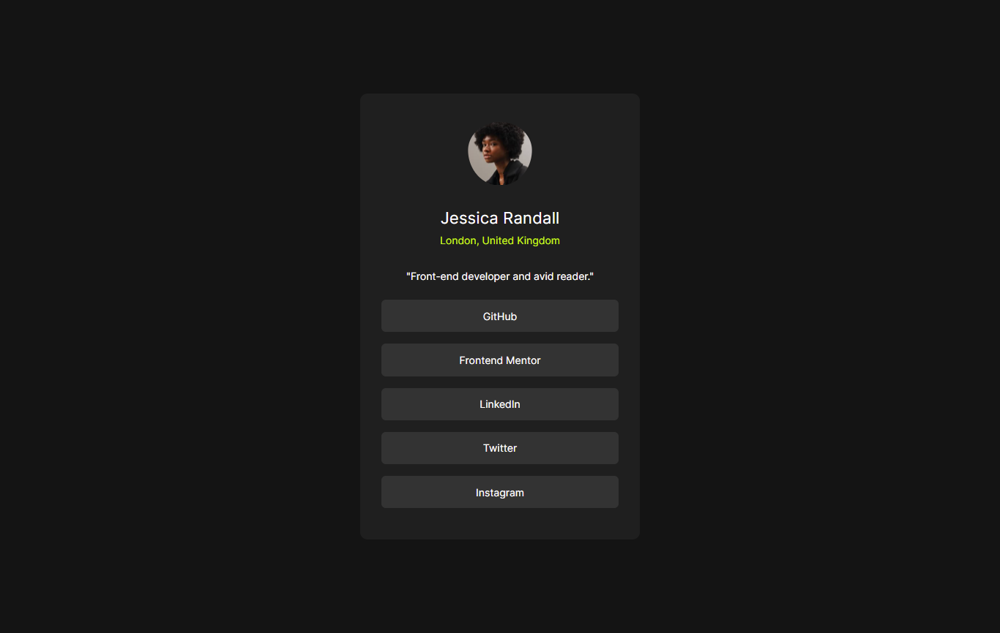

# Frontend Mentor - Social links profile solution

Esta es una solución a [Social links profile challenge on Frontend Mentor](https://www.frontendmentor.io/challenges/social-links-profile-UG32l9m6dQ).  

## Tabla de contenidos

- [Descripción](#descripcion)
  - [Screenshot](#screenshot)
  - [Links](#links)
  - [Mi proceso](#mi-proceso)
  - [Desarrollado con](#desarrollado-con)
  - [Lo que aprendí](#lo-que-aprendi)
  - [Desarrollo continuo](#desarrollo-continuo)
  - [Recursos útiles](#recursos-utiles)
- [Autor](#autor)

## Descripción
Challenge de Frontend Mentor realizado a fines de practicar HTML5, CSS3 y diseño web.

### Screenshot

### Links

- Solution URL: [Add solution URL here](https://your-solution-url.com)
- Live Site URL: [Add live site URL here](https://your-live-site-url.com)

## Mi proceso
1. Comencé el proyecto utilizando el enfoque Mobile First, realicé una copia de los diseños de las resoluciones pedidas en el challenge y con la herramienta Excalidraw fui maquetando sobre la misma imagen.
2. Creé los archivos necesarios y armé la estructura, fui dando los estilos correspondientes al documento para la version mobile.
3. Agregué la media query para darle estilo al diseño desktop solicitado.
4. Creé repositorio local y remoto.

### Desarrollado con
- Etiquetas semánticas HTML5
- CSS3
- Flexbox
- CSS Flex
- Mobile-first

### Lo que aprendí
Maquetar sobre una imagen para así desarrollar más rápidamente y eficientemente la estructura del HTML. Practiqué conocimientos adquiridos en cursos realizados.

### Desarrollo continuo
Próximamente adaptaré este proyecto utilizando mis datos y redes sociales.

### Recursos útiles

- [Flex](https://css-tricks.com/snippets/css/a-guide-to-flexbox/).
- [MDN](https://developer.mozilla.org/en-US/).

## Autor
- Website - [María Airala](https://stateofdev.com.ar/)
- Frontend Mentor - [@mardeva](https://www.frontendmentor.io/profile/mardeva)
- Twitter - [@stateofdev_BA](https://www.twitter.com/stateofdev_BA)

